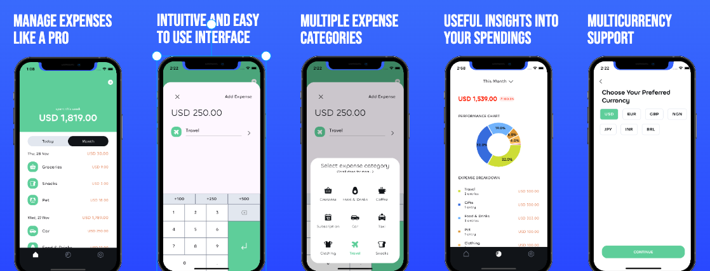

# Expense Bud

An app to help you keep track of your expenses and stay on top of your game 🚀

<a href="https://play.google.com/store/apps/details?id=app.expensebud">

<a/>

This app was built with clean architecture and MVVM pattern

**motivation**: To have clear seperation of concerns with loosely coupled components and a undirectional flow of data, This means our app is maintainable, scalable and testable.

### Screenshots

<p>
    
</p>

### Frameworks/Lib

**flutter:** Google's UI toolkit for building cross platform apps\
**provider:** State management library\
**get_it:** Dependency injection framework\
**hive:** Super fast key-value database library

### Run Locally

Clone the project

```bash
  git clone https://github.com/Iamstanlee/expense_bud.git
```

Go to the project directory

```bash
  cd expense_bud
```

Install dependencies

```bash
  flutter pub get
```

Run the app android or ios simulator

```bash
  flutter run
```

### Running Tests

To run tests, run the following command

```bash
  flutter test
```
